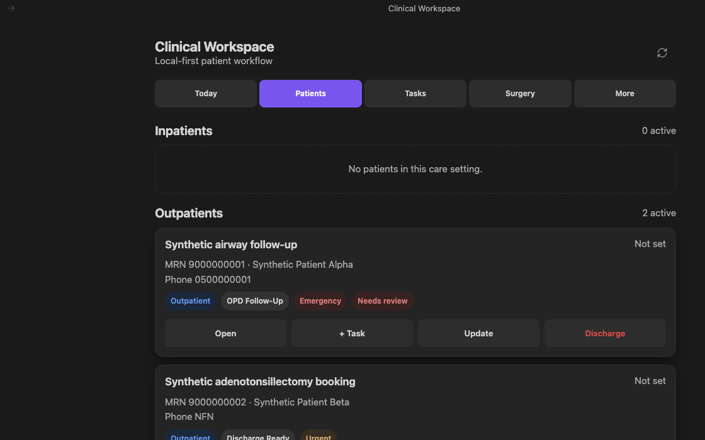

# Clinical Workspace for Obsidian

[](https://github.com/drbinsaad/obsidian-clinical-workspace/actions/workflows/ci.yml)
[](https://github.com/drbinsaad/obsidian-clinical-workspace/releases/latest)
[](obsidian://show-plugin?id=clinical-workspace)
[](LICENSE)

Turn personal patient follow-up, episode tasks, and surgical logbook entries
into one focused, mobile-first Obsidian workspace. Clinical Workspace keeps
each record as plain Markdown with YAML properties and stable internal links
inside your vault.


*AI-generated abstract project artwork; not a product screenshot.*

## Install

**[Open Clinical Workspace in Obsidian Community plugins](obsidian://show-plugin?id=clinical-workspace)**

Or open **Settings → Community plugins → Browse**, search for **Clinical
Workspace**, then select **Install** and **Enable**.

Community-directory availability is not a claim of clinical validation,
security certification, endorsement, or manual review by Obsidian staff.

> [!IMPORTANT]
> Clinical Workspace is a personal workflow aid. It is not an EHR/EMR,
> prescribing system, diagnostic system, or autonomous clinical
> decision-support tool. Confirm institutional approval for the device, vault,
> sync, retention, and backup route before storing identifiable information.
> The plugin does not provide encryption, access control, backup verification,
> or a compliance certification. Read the [security and privacy
> boundaries](SECURITY.md) before use.

## See the workflow



*Real Clinical Workspace 0.3.6 UI in Obsidian using demonstration-only records:
Synthetic Patient Alpha and Synthetic Patient Beta with 9000-series
MRNs and the reserved demonstration phone value `0500000001`. No real patient
data.*

| View | What it keeps in reach |
|---|---|
| **Today** | A ward-round list of inpatients, overdue work with its age, due-today, the next 7 days, and undated work. |
| **Patients** | Inpatient and outpatient cards with pathway, priority, next action, task templates, and per-episode history. |
| **Tasks** | Open, complete, cancel, reschedule, and add episode work, filtered by priority and type. Tasks can repeat on completion. |
| **Surgery** | OR booking queue, completed-procedure logbook, and portfolio counts by procedure and role. |
| **More** | Native Obsidian Bases, per-patient drill-down, identity correction and merge, archive/restore, ward handover notes, and integrity checking. |

A header search box (also **Clinical Workspace: Search clinical records**)
finds patients, MRNs, cases, tasks, and procedures from one field.

The workspace follows the width of its own Obsidian pane. In split layouts and
stacked tabs it shifts between wide, compact, and narrow presentations without
requiring the desktop window to be resized. Narrow panes keep cards and actions
in one readable column and make the workspace tab row independently scrollable.

The command palette now includes a **Quick entry** hub plus separate actions
for a new patient/Episode, task or follow-up, procedure, and today's pending
work. Procedure Quick Entry remains limited to eligible active OR-booking
Episodes. Assign your own desktop hotkeys or add any Quick Entry command through
**Settings → Mobile → Manage toolbar options → Add global command**; no default
shortcuts are imposed. The ribbon action appears in the desktop ribbon and
mobile **Open menu**, while toolbar placement is configured separately. Task
and procedure actions always require a visible Episode choice before their blank form opens.
See [Quick Entry, hotkeys, mobile toolbar, and safe local
links](docs/quick-entry.md). Obsidian may vary the exact setting labels by version.

## Five-minute synthetic quick start

1. Install the Community plugin in a new disposable test vault. Keep the vault
   unsynced while learning the workflow.
2. Run **Clinical Workspace: Open workspace**. Review the initialization prompt
   and initialize the genuinely new, empty workspace.
3. Run **Clinical Workspace: Quick entry: new patient / episode** and enter unmistakably
   synthetic details—for example, `Synthetic Patient Alpha` with MRN
   `9000000001`.
4. Open the episode, add a task, update its pathway or priority, then complete
   or cancel the task.
5. Create a second synthetic Episode with the **OR Booking** pathway, then use
   **Surgery → Complete surgery** to see the logbook flow.
6. Run **Clinical Workspace: Run clinical data integrity check**. It is silent
   when no problem is found.

Release builds do not contain the repository's development-only synthetic data
generator. Add test records through the normal interface so the exercise
matches the released plugin.

## Privacy at a glance

- Runtime clinical records are Markdown notes beneath the configured clinical
  folder (`Clinical Workspace` by default).
- The installed plugin makes no HTTP requests and contains no telemetry,
  analytics, crash reporting, or update checks.
- Runtime record and integrity scans recurse through the configured clinical
  folder. Recovery also checks the bounded list of retired clinical roots for
  late Sync deliveries; unrelated vault folders are not scanned. Other
  Obsidian plugins may still have access to the entire vault; install only the
  minimum institutionally approved set.
- Plugin settings contain the visible configuration plus aggregate recovery
  counts and a SHA-256 commitment over sorted opaque Patient, Episode, Task,
  and Procedure IDs. They can also retain up to 64 prior clinical-folder names
  after successful moves so a late old-folder Sync delivery remains visible to
  recovery. The audit Event log is intentionally outside this recovery
  commitment. A one-entry device-local recovery journal additionally stores
  those aggregates, a SHA-256 binding to the configured root, and one-way
  fingerprints of the retired-folder list. Neither store contains a raw MRN,
  patient name, phone number, raw record ID, clinical-note path, or clinical
  text; only synced settings contain the configured and retired folder names.
- Notes are plain text. Confidentiality depends on device encryption, screen
  lock, vault access, the chosen sync route, and organizational controls.
- Duplicate prevention is per device. After a Sync conflict or concurrent edits
  on different devices, run the integrity check.
- Audit notes are best-effort and multi-file operations are not transactional.
  A reported failure may leave earlier writes in place.
- Optional Quick Entry Obsidian links contain a fixed action only. Any query
  parameter is rejected, and a link can open only the hub, an explicit Episode
  chooser, a blank form, or the Today view; it cannot submit clinical data.

For the complete threat model and non-goals, read [Security and
privacy](SECURITY.md).

## How records fit together

```text
Patient ──< Episode ──< Task
                 ├──< Procedure
                 └──< Event
```

- A Patient identity is reused by normalized MRN; leading zeroes do not create a
  second identity, while the entered display value is preserved.
- The Episode is the unit of care: setting, pathway, priority, next action, due
  date, and status.
- An Episode cannot be archived while it has an open Task. Completing the last
  Task moves it to `ready-to-close`; cancelled Tasks do not keep it stuck.
- Archive is a status, not a file move. Restore returns the Episode to its prior
  pathway while retaining the discharge outcome.
- Patient identities can be corrected or merged after explicit confirmation.
  A merge repoints linked records and retires the source as `entered-in-error`;
  it does not delete it.
- Stable IDs keep records connected when their note filenames change.
- Each workflow write is reread to confirm persistence, and workflow actions
  create Event notes.

Records created outside the plugin are not validated on entry. Run the
integrity check after any external import or edit; it detects unreadable notes,
unrecognised values, duplicate MRNs, missing relationships, and records filed
under a different Patient from their Episode.

## Requirements and installation options

The installed plugin runtime requires **Obsidian 1.13.0 or later** and supports
Obsidian desktop and mobile. Test the complete workflow with synthetic records
on every device and Obsidian version you plan to use.

Node.js is not required for the installed plugin. **Node.js 22 is required only
for repository development and the separate desktop logbook-export command.**

Community installation is the recommended stable route. Alternatives:

- **BRAT beta:** install BRAT, run **BRAT: Add a beta plugin for testing**, enter
  `drbinsaad/obsidian-clinical-workspace`, then enable Clinical Workspace.
  [Open the BRAT installer](obsidian://brat?plugin=https://github.com/drbinsaad/obsidian-clinical-workspace).
- **Manual:** download `main.js`, `manifest.json`, and `styles.css` from the
  same [GitHub release](https://github.com/drbinsaad/obsidian-clinical-workspace/releases/latest),
  place them in `<vault>/.obsidian/plugins/clinical-workspace/`, restart
  Obsidian, and enable the plugin. Never install a development build in a vault
  containing real patient information.

Removing the plugin removes its installed code and settings, not the configured
clinical folder or its records. Back up and verify those notes before moving or
deleting them yourself.

## Settings and operational safety

Open **Settings → Community plugins → Clinical Workspace**.

| Setting | Purpose |
|---|---|
| Your name or initials | Actor recorded in Event notes; blank is stored as `local-user`. |
| Care setting, pathway, priority | Defaults for Add patient; each remains editable per Episode. |
| Confirm before discharge | Requires typing `DISCHARGE` before archiving an Episode. |
| Run integrity check on first open | Surfaces integrity problems automatically and stays silent when none are found. |
| Refresh delay | Coalesces vault changes before redrawing the workspace. |
| Clinical folder | Moves the complete managed workspace; this is a migration, not a toggle. |

Folder changes deliberately fail closed when Sync evidence is incomplete or
ambiguous. A bounded history of retired clinical folders is synced so a late
delivery into an old root re-arms recovery on another Mac. Perform a move on
one fully synced device at a time and read
[Moving the clinical folder safely](docs/folder-migration.md) before changing
the setting.

## Surgery logbook exports

The repository includes a separate Node.js 22 command that joins completed
Procedure notes to their Episode context. It is desktop-only, is not bundled in
the plugin, and cannot be run from an installed Community, BRAT, or manual
plugin.

Its default CSV is **pseudonymized, not anonymous or de-identified, and remains
confidential**. Direct identifier columns require `--identifiers`; free text,
dates, rare-case context, and stable references can still identify a person in
the default export. Output must be outside both the source vault and source
repository.

Read [Exporting the surgery logbook](docs/logbook-export.md) before running the
command.

## Development

Development and repository utilities use Node.js 22:

```bash
npm ci
npm run check
```

`npm run check` runs strict TypeScript checking, linting, a production build,
and the test suite. The build writes only to local `dist/` unless an explicit
vault installation path is supplied.

To install a production build into a test vault:

```bash
npm run build
npm run install:vault -- "/path/to/test-vault"
```

Development-only synthetic fixtures require `CLINICAL_DEV_TOOLS=1`. They are
compiled out of release builds, and release verification fails if they remain
in `dist/`. See [Contributing](CONTRIBUTING.md) for the development workflow.

## Project links

- [Changelog](CHANGELOG.md)
- [Contributing](CONTRIBUTING.md)
- [Data model reference](docs/data-model.md)
- [Security and private vulnerability reporting](SECURITY.md)
- [Quick Entry, hotkeys, mobile toolbar, and safe local links](docs/quick-entry.md)
- [Support](SUPPORT.md)
- [Code of conduct](CODE_OF_CONDUCT.md)
- [Issue tracker](https://github.com/drbinsaad/obsidian-clinical-workspace/issues)
- [MIT license](LICENSE)

Clinical Workspace is independent from [Knowledge Base Command
Center](https://github.com/drbinsaad/knowledge-base-command-center). A vault
containing identifiable clinical records should contain only the minimum set of
plugins approved for that vault.
